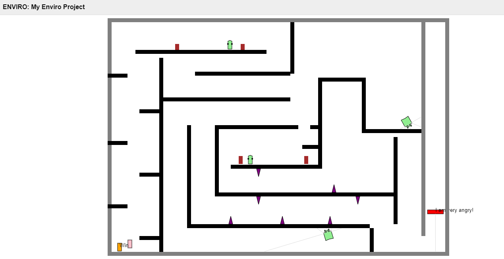
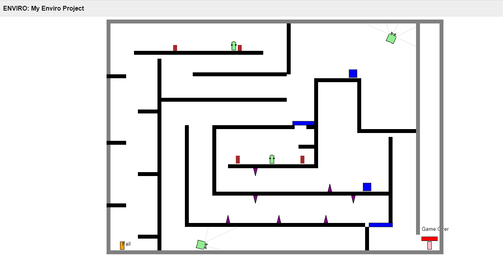

EE P 520 Final Project
==
## Project Goal
The purpose of this project was to use C++ and multi-agent systems to build a Room Escape game. You need to control a knight to save the princess to prevent her from attacking by the Lord of the Dark Castle. A user-controlled agent (Knight) needs to pass through the blockade of other automatic agents (Ghost, Guard and Trap), and also needs to find the corresponding key in order to unlock the corresponding door. User-controlled robots can only move and jump left and right, while Ghosts work on a specific area and Guards can patrol the entire castle.

## Game Description and Instructions
In this game, you, as a knight, are trying to pass the castle to save the princess! The Lord of the Dark Castle (the red square robot) finds that you had entered the castle and he was very angry and wanted to kill the princess. You should take the princess before he approaches the princess. If you exceed the time, you will lose the princess forever. But there are ghosts and guards everywhere in the castle. You can appear in the guard's field of vision, but you cannot touch him. Ghosts will only appear in certain places and you need to find the right time to avoid them. Don't let yourself be caught by the trap (brown triangle on the map)! Touch guard, ghost and traps, and you're back at the beginning of the castle gate! When you find nowhere else to go, try to find a hidden key. Get it and the hidden door will open. When you find the princess, you and the princess will return to the entrance position together.

## Installing & playing the game
Please note that the following steps are based on a Windows 10 computer. Mac computers follow similar steps, but some steps may be slightly different. However, the overall process for both systems remains the same.

Here are the steps to install and play the game:

1. Make sure you have git installed on your computer and clone repository into a folder on your local drive

```bash
git clone https://github.com/tank606/EEP520_Final.git
cd EEP520_Final
```

2. The project uses `ELMA` and `ENVIRO` software packages. Repositories and information on how to use them, call them, and implement them can be found in the links shown below:

- [ELMA](https://github.com/klavinslab/elma)<br />
- [ENVIRO](https://github.com/klavinslab/enviro) <br />


3.  Make sure that Docker is installed on your computer. Both ELMA and ENVIRO are pre-loaded into Docker images/containers, which makes calling these packages easier. Go to the directory where you copied the project and do the following in a terminal window:

```bash
docker run -p80:80 -p8765:8765 -v $PWD:/source -it klavins/enviro:v1.4 bash
```

4. To run the game: in the terminal, within the EEP520_Final directory run
```bash
esm start
```

5. Open up a browser and Then navigate to http://localhost you should see a rectangular walled area.

6. Compile and run the game, from inside the EEP520_Final directory run:
make
enviro

7. The game should now start in your browser. Use the space, "a" and "d" key to move the knight.

8. Enjoy the game. You can press Ctrl-C to stop the enviro server. 

Friendly reminder: During the game, take care of your keyboard and sometimes you want to throw it away.


## Agents Introduction

### Knight
The knight.h file controls the functions of the robot(yellow robot). The functions implemented are as follows: turns off rotations, simulate gravity, jumping, and left/right movement. It also 'watches' for some events(caught, win, fail) being sent from other classes and responds to them as appropriate.

### Princess
The princess is a pink robot and is waiting for you to save. Princess is codenamed "princess," and all its functions are controlled by the princess.h file. The princess doesn't need to do anything, just wait for the knight. So, I add notice_collisions_with("Knight") to detect if the knight has arrived. If it happens, emit Event("win"). 

### Keys and Gates
For fun, I design some closed doors. You have to find the corresponding keys(Blue robots) in order and open the corresponding doors. Repeat the cycle until the last door is finally opened. I add collision detection in key.h for knight and emit the event("key") to deletes the current key. This event is also detected in gate.h, and then the corresponding gate is opened.

### Guards
The guards are green robots that can automatically navigate on the map. It mainly has two functions: MovingForward and Rotating. For MovingForward, guards move forward while detecting the distance from the obstacle. If the distance is short, they will switch to Rotating mode. In the Rotating mode, 
the direction of rotation is chosen randomly to initialize until there are no obstacles in a certain direction. It also detects if it collides with the Knight.

### Ghost
Ghost(green robots) initiates reverse motion by detecting bumper collisions. In the process of movement, the force is continuously reduced to achieve the purpose of uniform speed movement.

### Traps
Considering that traps(purple robots) do not need to move, they are defined as a static type. Besides, collision detection with Knight is required to make Knight go back to the start point.

### The Lord of the Dark Castle
The Lord is the red robot approaching the princess. The code name for the Lord is "lord". Two main classes control the main functions, MovingForward and Stop. The "MovingForward" class controls the speed at which the robot moves forward. When approaching the princess, I use a stop function to stop and emit an event "fail".


## Key Development Challenges
During the development of this project, I encountered some challenges that took me some time to figure out. As a student majoring in biological engineering, this course is my first course on programming C++. I still remembered one typo bug on the first assignment. See the list below for the main challenges:

- The first key challenge I had was designing an interesting and feasible castle. How to design a maze reasonably needs to weigh the fun and difficulty. Too rich elements will make the game more challenging. At the beginning of the project, I added as many elements as possible to the castle to make the game fun. However, when I tested the game, I found that the game became more complicated, and different elements directly tried to conflict. In addition, using code to build visualization components is a time-consuming and laborious task. Each time you need to predict the coordinates, then modify the code, compile, and finally check whether it is correct from the web page. This process is continuously cycled until the end. 

- The second challenge: the guard distribution. At the beginning, guards were added at each intersection to enhance the fun of the game. At this point, the problem occurred. Multiple guards may be concentrated in one area, which makes the game scene very complicated, the game becomes too difficult, and even the situation of death (the intersection is blocked.) I solved this problem by reducing the number of guards and Add other exciting elements, like ghosts. In addition, the guard patrol area should be separated as much as possible to prevent multiple guards in one area, which will cause intersection blocking, and design a narrow space as much as possible to reduce the occurrence of guard rotation.

- The third challenge: the choice of object type. Even if it is wall-like, I cannot simply use JSON build picture because there are states that need to be triggered. Define the types of different objects. For example, the gate needs to be an object that can be opened and changed, so you need to create a new class instead of directly using config to build the wall, because the gate needs to respond to the event "key".

- The fourth challenge: establish the correspondence between key and gate. Since multiple doors need to be opened, multiple keys need to be provided. How to ensure that the first key found corresponds to the first door. Here, I briefly set the types of different keys for different keys and correspond to different doors. There are other ideas I can optimize in the future: calculate the direct distance between the current position and all doors, open the nearest door.


## Acknowledgments

The project was developed based on example code Dr. Klavins provided as well the Elma (event loop manager) & ENVIRO which the documentation and source code can be found at https://github.com/klavinslab.

Thanks to Professor Eric Klavins, Rajendra Hathwar, and Victor Cannestro for your support, help, and mentoring.


## Game rendering
# Win

# Fail
